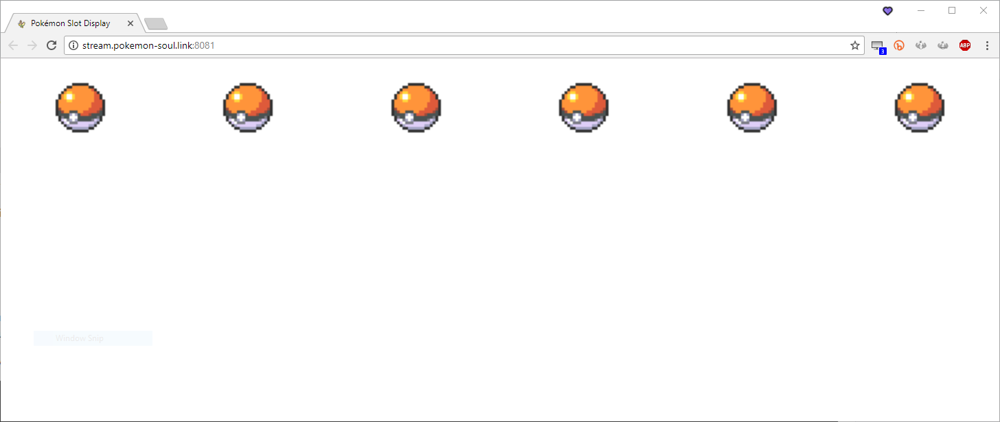
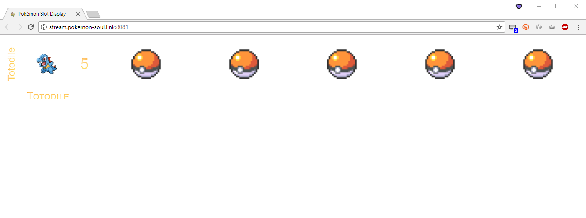

Build
=====

Let's build with the default configuration and see what we've got before diving into what you can change.  

First, we need to tell the Lua scripts what version of the game you're running.  Open up `/lua/game_version.lua`.  It should look something like this:

```lua
--for different game versions
-- 1 = Ruby/Sapphire U, 2 = Emerald U, 3 = FireRed/LeafGreen U, 4 = Ruby/Sapphire J, 5 = Emerald J (TODO), 
-- 6 = FireRed/LeafGreen J (1360)
local gen3_game = 3

--0: Ruby/FireRed, Emerald
--1: Sapphire/LeafGreen
local gen3_subgame = 0

-- 1 = Diamond/Pearl, 2 = HeartGold/SoulSilver, 3 = Platinum, 4 = Black, 5 = White, 6 = Black 2, 7 = White 2
local gen4_gen5_game = 2

-- 1 = Diamond, HeartGold, Platinum, Black, white, Black 2, White 2
-- 2 = Pearl, SoulSilver
local gen4_gen5_subgame = 1
```

I'm not going to lie.  If you can't figure out what to do here, you should probably seek professional help. :barbShots::barbFired: 

Set the proper values, save, and exit.

Now `cd` into `/node/` if you aren't already there and run

```dos
build.cmd
start startServer.cmd
```

Your Party Display will now be hosted at [http://stream.pokemon-soul.link:8081/](http://stream.pokemon-soul.link:8081/).

<div class="d-flex justify-content-around mb-2">

</div>

You should have something that looks like this.  If you don't, something went wrong.  In fact, I'd go so far as to say the world is about to end and it's your fault.  Just speakin' truth, man.

<a href="#" data-toggle="collapse" data-target="#having-troubles">If you are having troubles at this point...</a>
<div id="having-troubles" class="collapse" markdown="1">

Close the window that opened when you ran `start startServer.cmd`, and then run:

```dos
git reset --hard HEAD
git clean -f
rmdir /s /q public
npm i
build.cmd
start startServer.cmd
```

Now refresh your browser.
</div>

Let's put something other than PokéBalls&trade; up there.

1.  Open up your emulator
2.  Load your Pokémon ROM
3.  Click Tools / Lua Scripting / New Lua Script Window
4.  Click Browse...
5.  Find the `/lua` directory in the cloned repository and open either `auto_layout_gen3.lua` or `auto_layout_gen4_gen5.lua` depending on which game you're running.

![[danger]
Do **not** use `auto_layout_gen*_soul_link.lua`, even if you are set up to run SoulLink.  The scripts I've modified are the basic ones.  I only left the `*_soul_link.lua` scripts in there so the other scripts wouldn't get lonely.
]!

Load a game or a save state or start a new game and play until you pick your first pokémon.

<div class="d-flex justify-content-around mb-2">

</div>

If that's good enough for you, great!  Open up OBS Studio or XSplit, add a Browser Source, point it to [http://stream.pokemon-soul.link:8081](http://stream.pokemon-soul.link:8081), slap it on top of a blue background so the text shows up nice, and you're set!  Nuzlocke is enabled by default, so you can open up [http://stream.pokemon-soul.link:8081/dashboard](http://stream.pokemon-soul.link:8081/dashboard) to keep track of the pokémon you've caught (there's also a shortcut in the `/node` directory).  Happy training!

![[warning]
A note for **XSplit users**:

As of April 2018, there is a bug in XSplit that requires you set one setting in `config.json`.  It's toward the bottom.

```json
{
    "server": {
        "useLessSecureAPI": true
    }
}
```

Just set that value to `true`, save, and quit.  Now XSplit should be able to access the page correctly.
]!

<div class="next-btn" data-prefix="Let's get" data-btn="Configuring!" data-href="/setup/configuration"></div>