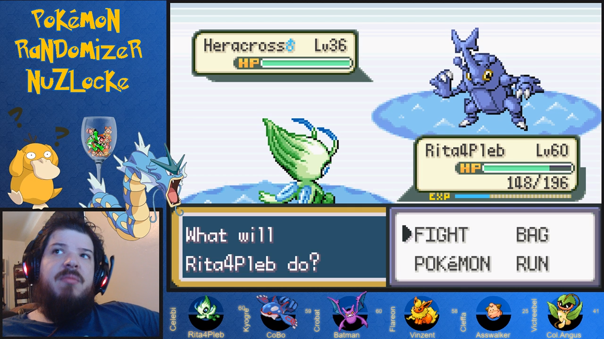

What is it?
===========

Pokémon Soul.Link is a set of tools to aid in the streaming of Pokémon games.

Originally Pokémon Soul.Link was built as a simple improvement to **[EverOddish's PokeStreamer-Tools](https://github.com/EverOddish/PokeStreamer-Tools)** for [Failstream](https://twitch.tv/failstream) who, at the time, was running a Nuzlocke challenge of Pokémon FireRed.  The primary issue with EverOddish's script is that every time a pokémon changed position within the party, it performed a synchronous write of image files to the hard drive (*synchronous* meaning, the game doesn't move on until the operation is complete).  This caused the game--particularly the audio--to lag.

Due to some quirks of the programming of FireRed, this happened at least four times in a row whenever a pokémon was switched out in battle (twice per pokémon), and as a frequent viewer of Failstream's stream, this sound lag drove me crazy.  So, as much as it was a project to help Failstream, it was also a selfish endeavor.

As I'm a solving-interesting-problems-with-code addict (no, really, it's a problem), this project quickly spiraled out of control.  Eight weeks and ~19000 lines of code later, it's become its own suite of tools, complete with a web GUI.

How it works
------------

Rather than writing image files to the hard drive, Pokémon Soul.Link runs a local [Node.JS](https:nodejs.org) webserver.  The Lua script then sends updates to the server, and the server relays those updates to a webpage which is displayed in your streaming software (OBS Studio, XSplit, etc).  These updates to the server are still synchronous, but take significantly less time than writing files to the hard drive.

All provided features work for both unmodified ROMs and randomized ones.

Features
========

Pokémon Soul.Link's serving of images to your streaming software was just the beginning.

Party Display
-------------

The most important feature, at least for streaming, is the Party Display&trade;.  This provides live updating of the pokémon in your party.  Each slot can display the pokémon's:

*   image, including shiny images, gender-specific images, alternate form images, and eggs
*   species
*   nickname
*   level
*   special styles for when your pokémon has fainted

    

    

Perhaps most importantly, the layout and styles are completely customizable.  Simple customizations can be done intuitively in the config.  More complex customizations can be set in the `styles` section of the config, which is converted to [CSS](https://www.w3schools.com/css/), or you can provide your own [SASS](https://sass-lang.com/)/CSS files for even more extensibility.

Dashboard
---------

The Dashboard is helpful for running [Nuzlocke](https://bulbapedia.bulbagarden.net/wiki/Nuzlocke_Challenge) and [SoulLink](https://nuzlockefamily.deviantart.com/journal/Soul-Link-Randomized-Nuzlocke-511651842) challenges.  While Pokémon Soul.Link doesn't *enforce* the rules of the challenge, it does track the pokémon you've caught, including where they were caught, whether or not they are shiny, and whether or not they are static encounters.  Further, for SoulLink runs, it keeps track of each pokémon's link.

### Nuzlocke ###

When Nuzlocke is enabled in the config (and SoulLink is disabled), the Dashboard provides a simple method of tracking which pokémon you've caught, where you caught them, and whether they're static or shiny.  It also has a graveyard section that is automatically updated when one of your pokémon die.

### SoulLink ###

When SoulLink is enabled in config, the Dashboard provides the same functionality as the Nuzlocke Dashboard, and on top of that, allows you to manage links between your pokémon and your partner's.  This can be done manually (by picking pokémon species from a drop down), or semi-automatically via server-to-server communication over Discord.

Multiple Configurations
-----------------------

The main configuration file, `config.json`, has an option called `configOverride` which is a list of configuration files that overwrite whatever settings are specified in the main file.  This can be helpful if you are running multiple games at once.  For example, if you are running a solo game and a SoulLink game on different days of the week, and thus have two different layouts, you can simply switch between the two layouts by changing one line in `config.json`.

Another application for multiple configurations might be if you are running two SoulLink games with different partners using the [Discord soul linking method](#soullink).  Different config files can specify different Discord settings for each partner.

Games Supported
===============

**Party display** is supported for generations [III](https://bulbapedia.bulbagarden.net/wiki/Generation_III), [IV](https://bulbapedia.bulbagarden.net/wiki/Generation_IV), and [V](https://bulbapedia.bulbagarden.net/wiki/Generation_V).  Those are the games supported by the original EverOddish scripts, and while I have heavily modified those files, I have not added support for other games, merely extended the current support for those games.

Support for the **Dashboard** is a little hazy, mostly because I haven't tested it on most games.  Also, at the time of writing this documentation, I am fairly sleep-deprived and cannot really remember what will and won't work for various games.

I'm certain that basic Nuzlocke functionality works for gen III games and HeartGold/SoulSilver.  I *think* it will work for the other gen IV games and gen V games..?  I'm 75% confident it will.

For sure, static encounter detection is only available for HeartGold/SoulSilver.  This prevents any sort of automatic-linking for SoulLink runs, but won't prevent you from manually specifying that a pokémon was a static encounter.  It's entirely possible that SoulLink functionality will work in all gen III-V games, but I only know for certain that it works for HeartGold/SoulSilver.

If you try it on another game and a feature doesn't work, it would probably take me a couple hours to enable/fix it for your version (though I'm not guaranteeing that I'll have time to do that work).  If you want to run one of these games, and use Pokémon Soul.Link to do so, contact me on my [Discord server](http://discord.pokemon-soul.link).

Contact
=======

You can contact me on my [Discord server](http://discord.pokemon-soul.link) for help and questions, or to request support for another gen III-V Pokémon game.

!![info]
If
*   after you've set up the tool following the [setup instructions](/setup) (to the best of your ability--the instructions might be a little complicated, and, like all software, the tool is subject to the alignment of the stars and whether [Punxsutawney Phil](https://en.wikipedia.org/wiki/Punxsutawney_Phil) saw his shadow last February 2nd), 
*   the layouts provided by the included config files aren't styled the way you'd like, and
*   you can't figure out how to modify the config files to achieve a style that fits your stream layout,

feel free to ping me on Discord; if I have time, I may send you a customized configuration with the styling you want.
!!
Roadmap
=======

I have no idea if I'll ever get around to implementing any these features, as I've already spent *way* too much time on this project at the expense of many of my real life responsibilities, but I may eventually add:

#### Nuzlocke ####

*   A graveyard display page (I've already begun this, but haven't decided whether to finish it)
*   Ensure support for all gen III-V games
*   Additional fun-to-have death animations/styles

#### SoulLink ####

*   Ensure/enable support for gen III-V games
*   Detect when a SoulLinked pokémon is not in your partner's party in order to show the pokemon as invalid in the Party Display
*   Automated deaths between SoulLinked pokémon (~25% done for gen IV/V games)
    -   *Maybe* automated linked status effects (e.g. suddenly: *poisoned!*)
*   SoulLinking via a web proxy rather than using Discord
*   Better support for automatic linking (linking shiny pokémon based on the order they were caught, fixing bugs of existing automatic linking, etc)

#### Configuration and Game Management ####

It might be helpful to provide a UI for basic configuration setup.

Additionally, running multiple games at once (e.g. different SoulLink partners on different days) currently requires the manual renaming of data files to switch back and forth between games.  Switching games could be managed with a dropdown.

#### Chat Interactivity ####

Almost certainly I will never implement these, but they would be fun.

*   Use bits or stream-specific "currency" to purchase in-game effects (what I'd call *Hunger Games Sponsor mode*)
    -   Heal the current pokémon
    -   Heal the whole team
    -   Restore PP to the current pokémon
    -   Add item to inventory
    -   Or, if you're a masochist (( (*cough*FAIL*cough*) )) and want to *fight against* chat, they might purchase the death of one of your pokémon or to apply a status effect at an inopportune moment
*   Use voting to select what pokémon appears in the next wild encounter

#### Additional Generation Support ####

It may be nice to support gen VI and VII games, but that will likely rely on someone else writing the Lua scripts, as I really have no idea how to search for things in game memory.  The extensions to the Lua scripting I *have* done have relied heavily on the existing scripts, and I've had little success finding other positions, such as where Bill's PC is (it seems to move around when you start a new game).  They've also relied on Bulbapedia's information on the pokémon's data structure; pages corresponding to gen VI and VII games don't yet exist.

Credits
=======

[[
Failstream
----------

[Failstream](https://twitch.tv/failstream) was the whole reason I began this project, so a huge thank you to him.  He provided a lot of testing (whether he knew it or not) that I did not have time to do, as it would have required hours of my own gameplay.

Fail is best known for [Fail's Floatilla : Final Flight](https://supermariomakerbookmark.nintendo.net/courses/154E-0000-0358-C2FB) aka *The Impossible Cape Level*, a Super Mario Maker level that took him 482+ hours to beat.

Watch his clear video (nsfw language), see how awesome he is, and then follow him on [Twitch.tv](https://twitch.tv/failstream)!

    <iframe width="560" height="315" src="https://www.youtube.com/embed/DnodpKqEYu4" frameborder="0" allow="autoplay; encrypted-media" allowfullscreen></iframe>

He has also offered to create the Tutorial videos for the tool and host them on his [YouTube channel](https://www.youtube.com/channel/UCrWpNIjmFZ0YFYRovw-tMIA), which is great for three reasons:

1.  I don't have to make the videos
2.  His channel has actual followers, providing exposure for this tool that I could never achieve
3.  He's a lot better at speaking than I am -- that's more of a good thing for you than for me
]]

[[
EverOddish
----------

This project would not have been possible without [EverOddish's original PokeStream-tools](https://github.com/EverOddish/PokeStreamer-Tools), so a special thanks to him.

EverOddish credits:

> * A huge thank you to FractalFusion and MKDasher of Pokemon Speed Runs for their initial Lua script work! http://forums.pokemonspeedruns.com/viewtopic.php?t=314
> * A huge thank you to the 3DS modding community for their work on CFW, BootNTR, PKMN-NTR and others!
> * A huge thank you to PokemonChallenges for helping me test all this! (Check him out at http://twitch.tv/PokemonChallenges)
]]

[[
iIPK
----

[iIPK](https://twitch.tv/iipk) has also been instrumental in testing the SoulLink functionality and has been super patient working through the kinks of setting up and updating the tool, so a special thanks to him.
]]
Resources
---------

#### Discord.JS ####

[Discord.JS](http://discord.js.org) is a library for accessing Discord via NodeJS.  Without it, I could not have implemented automatic SoulLinking.

#### Pokémon Technicals ####

I don't know if you can credit an entire wiki, but [Bulbapedia](https://bulbapedia.bulbagarden.net) provided much of the technical details on how to access and decrypt memory.

Much of the data (such as static encounters) I pulled from the [PKHeX project](https://projectpokemon.org/home/forums/topic/29182-pkhex-gen-1-7-savpkm-editor/) ([source](https://github.com/kwsch/PKHeX)), a *comprehensive* tool for viewing, editing, and creating pokémon that can be (re)loaded into ROMs of every generation to date.  This saved me literally days worth of research and data entry.

#### Images ####

The large sprite images I used in this project, and have suggested in the Setup documentation that you use were provided by [Typhlosion](http://pkmn.net/?action=profile&member=80) and hosted by [pkmn.net](http://pkmn.net/?action=content&page=viewpage&id=8644).

The small sprites included in this project's repository (as I could not figure out how to link a git repository within my own), are provided by [msikma's PokéSprite Image Sprite Generator](https://github.com/msikma/pokesprite).  Those sprites are used in the Dashboard, and will be used in the Graveyard if I ever get around to it.

##### msikma's License section #####

> The source icons are © Nintendo/Creatures Inc./GAME FREAK Inc.
>
> Everything else, and usage of the programming code, is governed by the [MIT license](http://opensource.org/licenses/MIT).