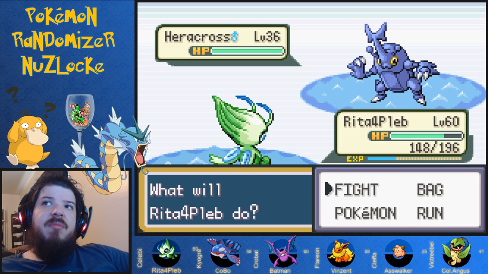

What is it?
===========

Pokémon Soul.Link is a set of tools to aid in the streaming of Pokémon games.

Originally Pokémon Soul.Link was built as a simple improvement to **[EverOddish's PokeStreamer-Tools](https://github.com/EverOddish/PokeStreamer-Tools)** for [Failstream](https://twitch.tv/failstream) who, at the time, was running a Nuzlocke challenge of Pokémon FireRed.  The primary issue with EverOddish's script is that every time a pokémon changed position within the party, it performed a synchronous write of image files to the hard drive (*synchronous* meaning, the game doesn't move on until the operation is complete).  This caused the game--particularly the audio--to lag.

Due to some quirks of the programming of FireRed, this happened at least four times in a row whenever a pokémon was switched out in battle (twice per pokémon), and as a frequent viewer of Failstream's stream, this sound lag drove me crazy.  So, as much as it was a project to help Failstream, it was also a selfish endeavor.

As I'm a solving-interesting-problems-with-code addict (no, really, it's a problem), this project quickly spiraled out of control.  Eight weeks and ~19000 lines of code later, it's become its own suite of tools, complete with a web GUI.

How it works
------------

Rather than writing image files to the hard drive, Pokémon Soul.Link runs a local [Node.JS](https:nodejs.org) webserver.  The Lua script then sends updates to the server, and the server relays those updates to a webpage which is displayed in your streaming software (OBS Studio, XSplit, etc).  These updates to the server are still synchronous, but take significantly less time than writing files to the hard drive.

All provided features work for both unmodified ROMs and randomized ones.

Features
========

Pokémon Soul.Link's serving of images to your streaming software was just the beginning.

Party Display
-------------

The most important feature, at least for streaming, is the Party Display&trade;.  This provides live updating of the pokémon in your party.  Each slot can display the pokémon's:

*   image, including shiny images, gender-specific images, alternate form images, and eggs
*   species
*   nickname
*   level
*   special styles for when your pokémon has fainted

<figure class="img-modal mx-4 mb-4">
    
    <figcaption>Failstream playing a Nuzlocke Randomizer with the party display</figcaption>
</figure>

<figure class="img-modal mx-4 mb-4">
    
    <figcaption>Failstream playing a SoulLink run with the party display</figcaption>
</figure>

Perhaps most importantly, the layout and styles are completely customizable.  Simple customizations can be done intuitively in the config.  More complex customizations can be set in the `styles` section of the config, which is converted to [CSS](https://www.w3schools.com/css/), or you can provide your own [SASS](https://sass-lang.com/)/CSS files for even more extensibility.

Dashboard
---------

The Dashboard is helpful for running [Nuzlocke](https://bulbapedia.bulbagarden.net/wiki/Nuzlocke_Challenge) and [SoulLink](https://nuzlockefamily.deviantart.com/journal/Soul-Link-Randomized-Nuzlocke-511651842) challenges.  While Pokémon Soul.Link doesn't *enforce* the rules of the challenge, it does track the pokémon you've caught, including where they were caught, whether or not they are shiny, and whether or not they are static encounters.  Further, for SoulLink runs, it keeps track of each pokémon's link.

### Nuzlocke ###

When Nuzlocke is enabled in the config (and SoulLink is disabled), the Dashboard provides a simple method of tracking which pokémon you've caught, where you caught them, and whether they're static or shiny.  It also has a graveyard section that is automatically updated when one of your pokémon die.

### SoulLink ###

When SoulLink is enabled in config, the Dashboard provides the same functionality as the Nuzlocke Dashboard, and on top of that, allows you to manage links between your pokémon and your partner's.  This can be done manually (by picking pokémon species from a drop down), or semi-automatically via server-to-server communication over Discord.

Multiple Configurations
-----------------------

The main configuration file, `config.json`, has an option called `configOverride` which is a list of configuration files that overwrite whatever settings are specified in the main file.  This can be helpful if you are running multiple games at once.  For example, if you are running a solo game and a SoulLink game on different days of the week, and thus have two different layouts, you can simply switch between the two layouts by changing one line in `config.json`.

Another application for multiple configurations might be if you are running two SoulLink games with different partners using the [Discord soul linking method](#soullink).  Different config files can specify different Discord settings for each partner.

<%= nextBtn('Ready to get started?', 'Begin Setup!', '/setup/') %>

Games Supported
===============

**Party display** is supported for generations [III](https://bulbapedia.bulbagarden.net/wiki/Generation_III), [IV](https://bulbapedia.bulbagarden.net/wiki/Generation_IV), and [V](https://bulbapedia.bulbagarden.net/wiki/Generation_V).  Those are the games supported by the original EverOddish scripts, and while I have heavily modified those files, I have not added support for other games, merely extended the current support for those games.

Support for the **Dashboard** is a little hazy, mostly because I haven't tested it on most games.  Also, at the time of writing this documentation, I am fairly sleep-deprived and cannot really remember what will and won't work for various games.

I'm certain that basic Nuzlocke functionality works for gen III games and HeartGold/SoulSilver.  I *think* it will work for the other gen IV games and gen V games..?  I'm 75% confident it will.

For sure, static encounter detection is only available for HeartGold/SoulSilver.  This prevents any sort of automatic-linking for SoulLink runs, but won't prevent you from manually specifying that a pokémon was a static encounter.  It's entirely possible that SoulLink functionality will work in all gen III-V games, but I only know for certain that it works for HeartGold/SoulSilver.

If you try it on another game and a feature doesn't work, it would probably take me a couple hours to enable/fix it for your version (though I'm not guaranteeing that I'll have time to do that work).  If you want to run one of these games, and use Pokémon Soul.Link to do so, contact me on my [Discord server](http://discord.pokemon-soul.link).

Contact
=======

You can contact me on my [Discord server](http://discord.pokemon-soul.link) for help and questions, or to request support for another gen III-V Pokémon game.

<%= fas('fa-code fa-fw', { transform: { size: 24 }}) %>

If...
*   after you've set up the tool following the [setup instructions](/setup) (to the best of your ability--the instructions might be a little complicated, and, like all software, the tool is subject to the alignment of the stars and whether [Punxsutawney Phil](https://en.wikipedia.org/wiki/Punxsutawney_Phil) saw his shadow last February 2nd), 
*   the layouts provided by the included config files aren't styled the way you'd like, and
*   you can't figure out how to modify the config files to achieve a style that fits your stream layout,

feel free to ping me on Discord; if I have time, I may send you a customized configuration with the styling you want.

