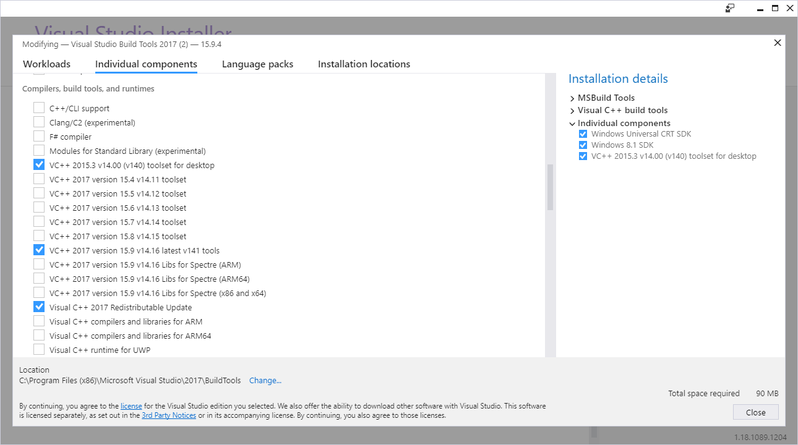

Setup
=====

Tutorial Videos
---------------

For those who prefer the dulcet tones of Failstream's voice to the monotonic inner voice you use when reading stuffy
documentation, might I suggest the [Tutorial Videos](/setup/tutorials/)?

Installation
------------

### Requirements ###

There are two sets of requirements: those of the original EverOddish PokeStreamer Tools, and those required for Pokémon
Soul.Link.  If you've been using PokeStreamer Tools for a while, well, look at you.  Always one step ahead.  I authorize
you to skip the next five-line subsection, assuming you know which version (32-bit or 64-bit) of the emulator you are
using.  If you don't, well, I guess we'll find out shortly, won't we?

#### PokeStreamer Tools requirements ####

> *   Windows operating system
> *   An emulator with Lua scripting support
>     *   [VBA-RR](https://github.com/TASVideos/vba-rerecording/releases) for gen 3 games
>     *   [DeSmuME](http://desmume.org/download/) for gen 4 and 5 games

#### Pokémon Soul.Link requirements ####

*   [Git for Windows](https://git-scm.com/download/win)
*   [Python **v2.7**](http://https://www.python.org/downloads/) used for building some dependencies ([download
    link](https://www.python.org/ftp/python/2.7.14/python-2.7.14.msi))
*   [Node.js](http://nodejs.org) - version 8.9.4 or newer
*   [Webpack](http://webpack.js.org) 4.1 or newer (this will be installed automatically later, but if you have an older
    version already installed, you may need to update)

##### Optional #####

*   [LuaSocket 2.0.2 32-bit](http://files.luaforge.net/releases/luasocket/luasocket/luasocket-2.0.2) - The included
    LuaSocket binaries in `/lua/` are [64-bit versions](https://download.zerobrane.com/luasocket-win64.zip) (as they're
    harder to come by).  If you are using a 32-bit emulator, you will need to download the 32-bit version and replace
    the 64-bit versions.
*   [Discord](https://discordapp.com/) - Required for SoulLink live linking functionality
*   Merging tool - when updating to the latest version of the Pokémon Soul.Link, incoming changes may conflict with
    changes you've made to your config.  A merge tool can be helpful in resolving those conflicts.
    *   [Meld](http://meldmerge.org/) - A simple, clean tool for comparing files/folders with decent merge capability
    *   [VS Code](https://code.visualstudio.com/) - Overkill if you are only using it for merging, but on top of making
        merging very easy, it's the best text editor I've found

### Set Up the Emulator ###

If you've been using the EverOddish scripts successfully, there's nothing new you need to do here.  If you're starting
up from scratch, there are a couple files not included with each emulator that are required.

#### VBA-RR ####

You may need not to do anything to set up VBA-RR, but a common error <span class="text-muted">(and one that I ran into
twice)</span> that might occur is the "white screen" glitch when loading the ROM.

::: card

To fix the white screen glitch:

1.  Download [vba-over.ini](https://www.emuparadise.me/links-and-downloads/Nintendo_GameBoy_Advance/vba-over.ini/5) and
    extract the zip ([download
    link](http://50.7.92.186/ukIpalnq13Lasfp75BBaa/epforums/upload/2/3/4/5/2/931711892903459632.zip))
2.  Place the ini file in your VBA-RR folder
3.  Close and reopen the emulator
4.  In the Options / Emulation / Save Type menu, make sure **Automatic** and **Flash 64** are checked (some sites say to
    use Flash 128, but that didn't work for me)

:::

#### DeSmuME ####

EverOddish did a great job documenting how to do this, so I'm just gonna do a little shameless copy pasta.
:copyThis::pastaThat:  <span class="text-muted">(I've removed the bits that aren't applicable anymore.)</span>

::: card

1.  Download the latest release of DeSmuME: [http://desmume.org/download/](http://desmume.org/download/)
2.  Make note of whether you downloaded 32-bit (x86) or 64-bit (x86-64) DeSmuME
3.  Download the Lua DLL that matches your DeSmuME: [Lua Windows
    Binaries](https://sourceforge.net/projects/luabinaries/files/5.1.5/Windows%20Libraries/Dynamic/)
    *   `lua-5.1.5_Win32_dll14_lib.zip` for x86 DeSmuME
    *   `lua-5.1.5_Win64_dll14_lib.zip` for x86-64 DeSmuME
4.  Extract `lua5.1.dll` from the .zip file to the same folder where your `DeSmuME_0.9.11_x86.exe` or
    `DeSmuME_0.9.11_x64.exe` is
5.  Rename `lua5.1.dll` to `lua51.dll`

:::

### Download the Repository ###

1.  <div>Open command prompt by pressing <kbd><%= fab('windows') %></kbd> + <kbd>r</kbd> and running <code>cmd</code>.</div>
2.  Navigate to the folder (using `cd`) you will want to install the server to.  (This is the *parent* directory;
    running the next command will create a folder named `PokeStreamer-Tools` automatically.  <span
    class="text-muted">Yeah, I never changed the name...</span>)
3.  Run `git clone https://github.com/dfoverdx/PokeStreamer-Tools.git`

Now open up the directory in Windows explorer (to make the next step easier), and then `cd` into the the node server's
directory.  This is where you will do the vast majority of things related to the server.

```dos
cd PokeStreamer-Tools
start .
cd node
```

### Download Pokémon Images <a id="pokemon-images">&nbsp;</a> ###

I *strongly* recommend you use the zip located
[here](https://github.com/dfoverdx/PokeStreamer-Tools-Docs/raw/master/static/PKMN.NETSR4.zip) as it includes all the
required images named the way my script expects them to be named (i.e. numbered by PokéDex number).

Download and extract this to your newly cloned directory's `/pokemon-images/` folder.  If you're using the zip above,
you'll need to move all the sub directories from `/pokemon-images/PKMN.NET Sprite Resource 4/Pokémon/` to
`/pokemon-images` (such that the `BW` folder is at `/pokemon-images/BW`), or if you're a masochist, you can change the
values in config.

Navigate to `/node` and run `setup.cmd`.  This script copies over the Arceus forms (haha, good luck getting him without
cheating), and renames some misnamed Giritina images.  It also does something with Spikey-Eared Pichu that I'm sure is
very important.  You should only have to do this once unless you reset/overwrite your images folder.

::: alert [warning] !exclamation
All images in the specified image directories (`config.advanced.json` has a list of
which directories these are) are loaded into memory by the server.  This isn't a problem for the images in the suggested
ZIP (~5MB depending on which generation), but if you use larger ones, you may run into some memory difficulties.
:::

::: alert [me] !star
If you have previously used PokeStreamer-Tools, you may remember that the images needed to be in
the same location as the Lua scripts.  This is no longer the case.
:::

### Install Dependencies ###

The server depends on a bunch of external libraries.  Downloading and installing these is an arduous task.  It requires
you press six keys.

```dos
npm i
```

:::: alert [secondary] !question

::: details Troubles installing node-sass / issues with node-gyp

`node-sass` relies on `node-gyp` and `node-gyp` is a royal pain in the Butterfree.  If `npm i` (or later in this
tutorial, `build.cmd`) is throwing a fit with a message about `node-sass` or `node-gyp`, you have a few options, any of
which may or may not work (because of the Butterfree I just mentioned).  **After you have tried any of these steps, you
must run `build.cmd` again.**

---

<div class="notes">

1.  The easiest solution is to reinstall node via the .msi file.  Odds are it will say that node is already installed;
    just click the Change button.  When it asks if you want to install *Tools for Native Modules*, check the box.

    <div data-modal-images>

    

    </div>

    After node finishes reinstalling, a command prompt window will appear.  It suggests closing all other programs
    during the install.  I don't know if this matters, but considering how finicky `node-gyp` is, I wouldn't take any
    chances.  Once you've made this dire decision and followed through with your commitment, close the command prompt
    window.  It will ask if you want to allow Powershell to run with elevated permissions (like it does anytime you
    install something in Windows).  Click yes (obviously).  A blue[^1] command prompt[^2] window called Powershell will
    appear and begin to install stuff.  Let it do its thing.  This will take a couple minutes.  In the meantime, go get
    some coffee.  Change a baby's diaper[^3].  Complete a Nuzlocke run.  Go wild.  The sky's the limit.

    If all goes well, open up command prompt, navigate back to `/node`, and re-run `npm i`.  If not, or if it still
    doesn't work, try the second solution below.

2.  The second solution is to follow the steps at
    [https://github.com/nodejs/node-gyp#on-windows](https://github.com/nodejs/node-gyp#on-windows).

    After you've finished, *close every command prompt*, open a new command prompt, navigate back to `/node`, and re-run
    `npm i`.  If it still throws a fit, try restarting your computer, and re-run `npm i`.  If it throws a fit after
    that, try performing a rain dance, and re-run `npm i`.  If it's still not working, try sacrificing a virgin[^4], and
    re-run `npm i`.

3.  If you have your source on a separate drive (i.e. not `c:\`), odds are you're going to see an error message like

    ```dos error
    error MSB4019: The imported project "E:\Microsoft.Cpp.Default.props" was not found. Confirm that the path in the
    <Import> declaration is correct, and that the file exists on disk.
    ```

    If you have installed Visual Studio 2015+ (not VS Code), boot up the VS Installer and make sure that *VC++ 2015.3
    v14.00 (v140) toolset for desktop* is installed.

    <div data-modal-images>

    

    </div>

    Now you'll need to make sure that the `VCTargetsPath` environment variable is set.

    ```dos
    echo %VCTargetsPath%
    ```

    If this prints an empty line, run

    ```dos
    dir "c:\Program Files (x86)\MSBuild\Microsoft.Cpp\v4.0\v140\Microsoft.Cpp.Platform.props"
    ```

    This should show that the file is found.  

    ::::: details If it is not...

    If it is not, then you have not installed VS build tools properly.  Hang your head in shame.  If you are
    convinced that you installed it properly and that the file simply isn't where it should be (either because you
    installed Visual Studio to a different directory or drive or because something else is weird), run

    ```dos
    c:
    cd c:\
    dir /s Microsoft.Cpp.Platform.props
    ```

    where `c:` is the drive you installed Visual Studio to.

    Choose the directory that includes *v140*.  This is important.  Later versions do not work.  I've tried.  Use
    this directory in the next step.

    ---

    :::::

    Assuming the file is found, first, give yourself a pat on the back.  Not a strong one, but enough to feel like
    you achieved at least *something* today.  Next run,

    ```dos
    setx VCTargetsPath "c:\Program Files (x86)\MSBuild\Microsoft.Cpp\v4.0\v140"
    ```

    If you get a permission denied error, you'll need to run command prompt as administrator and run the `setx`
    command again.

    Close command prompt and reopen it.  Run `echo %VCTargetsPath%` to ensure that the value was saved.  Navigate
    back to `/node` and rerun `npm i`.

4.  There are several possible solutions suggested on this Stack Overflow question: [How to solve 'node-gyp rebuild'
    issue on Windows 10?](https://stackoverflow.com/questions/32457761/how-to-solve-node-gyp-rebuild-issue-on-windows-10)

    The one I'd try first, simply because it's simplest, is running

    ```dos
    npm install --global --production windows-build-tools
    ```
---

If none of those solutions work, I honestly don't know what to tell you.  I've only successfully gotten `node-gyp` to
work when it wasn't working once, and I lacked the foresight to write down what steps I took.

</div>

:::

::::

### How to Update to the Latest Version ###

In the future, when there's an exciting new release hot off the--uhhh... github.  Hot off the github.  Well, when there
is and you're dying to get your hands on it, in Command Prompt, navigate to the `PokeStreamer-Tools/node` directory and
run:

```dos
git stash --include-untracked
git pull
npm i
git stash pop
```

::::: alert [warning] !info
When running `git stash pop`, depending on what kinds of edits you made, in particular to
`config.json`, the command might say something about merge conflicts.  

:::: details If you downloaded VS Code for your merge tool...

::: alert [dark]
Run:

```dos
code .
```

Then press <kbd>ctrl</kbd> + <kbd>shift</kbd> + <kbd>g</kbd> <span class="text-muted">(by default)</span> to open the
Source Control panel.  At the top will be a list of files with a `C` next to them.  

When you click on each of those files, VS Code will show you the changes made in the update as green lines, and changes
you've made in blue.  Above the green lines you can click a variety of buttons to helping you figure out what the final
version should be.  

<div data-modal-images>


</div>

Once you've made the appropriate changes, just save each file.

It's a little complicated to explain in text, especially when I have no idea what kind of background you, dear user,
have with coding.  I did a quick search through YouTube and came up with [this
video](https://youtu.be/AKNYgP0yEOY?t=1m53s).  It might be helpful.  It might not be.

:::
::::

:::: details If you downloaded Meld for your merge tool...

::: alert [dark]
Run:

```dos
git mergetool --tool meld
```

I'm not too experienced with Meld, myself, but running that command should bring up a window with three panels.  Those
panels should show you the changes from the update, the changes you made before the update, and the resulting file that
you need to fix up.

<div data-modal-images>


</div>

May the odds be ever in your favor.
:::
::::

If you've tried your best to use a merge tool, and still haven't gotten it working, hit me up on
[Discord](http://discord.pokemon-soul.link).

:::::

<div><%= nextBtn(`It's time to`, 'Build!','/setup/build') %></div>

[^1]: probably

[^2]: ish

[^3]: Your *own* baby's diaper, and even then only as needed.  <span class="text-muted">Pokémon SoulLink does not
condone changing a stranger's baby's diaper.  Seek permission first.  That said, Pokémon SoulLink doesn't *not* condone
this behavior.  The lawyers insisted upon this footnote.  Those sourpusses.  :failsSelfie:</span>

[^4]: Better make it two virgins, just to be safe.