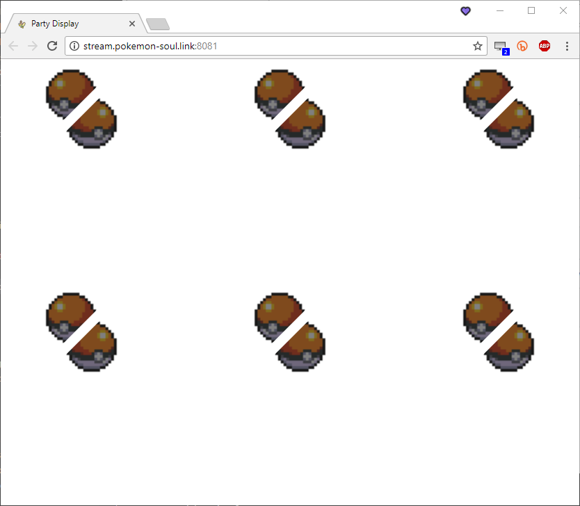
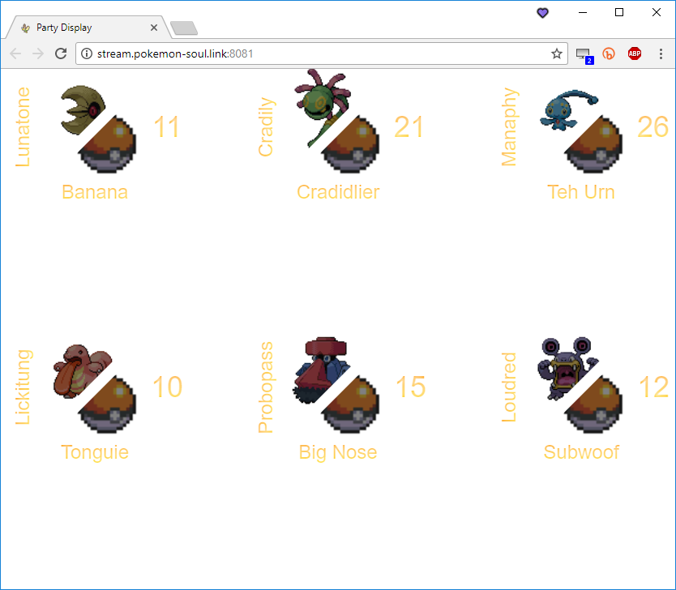
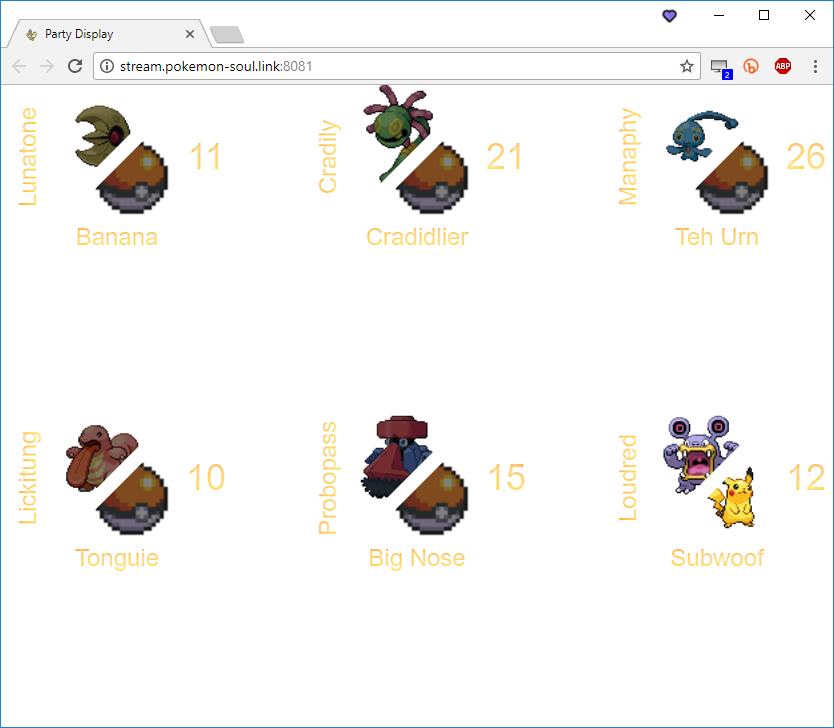
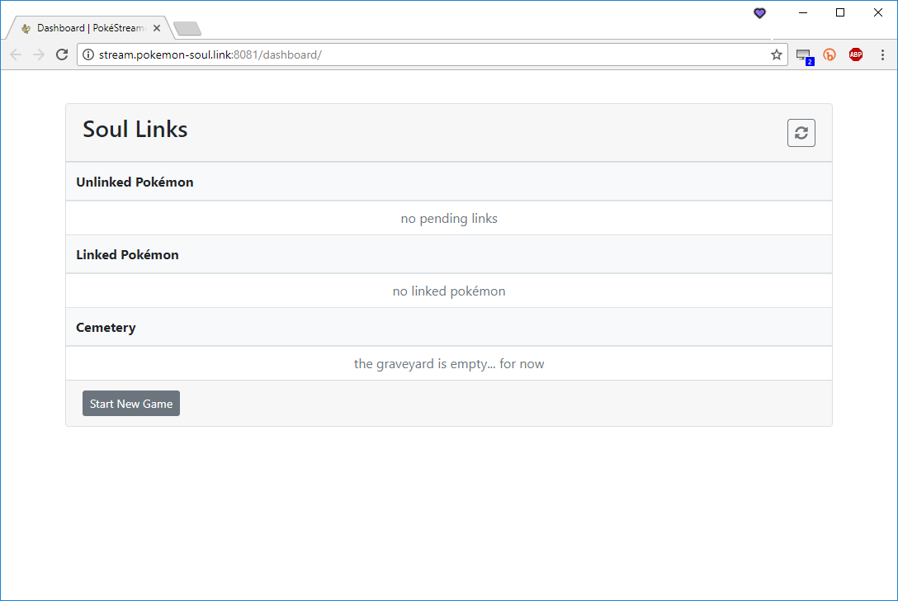
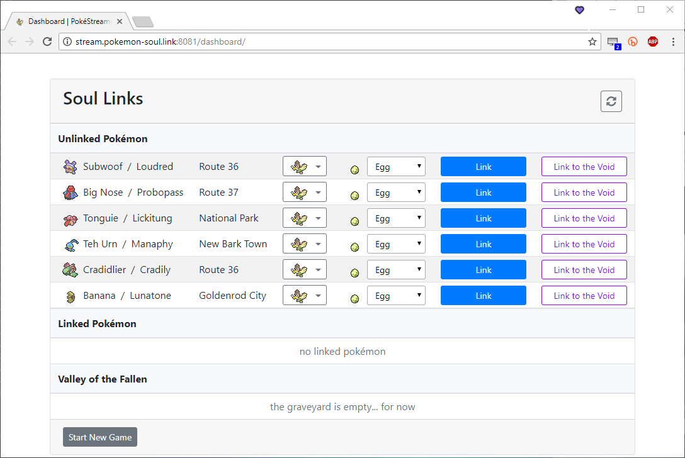
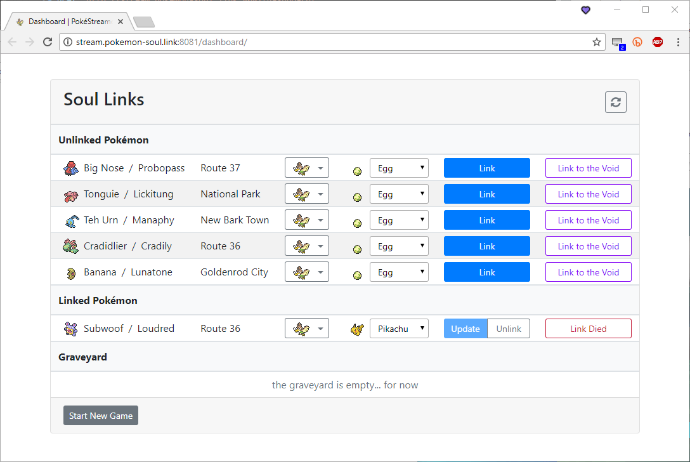

SoulLink
========

Using the SoulLink features, the Party Display can display two pokémon per slot: yours, and the pokémon of your partner's to which it is linked.  How your partner's pokémon's image is determined can be set manually via the Dashboard, or automatically with some additional setup.

Manual Linking
--------------

The simplest method for SoulLinking is doing it manually.  After you enable SoulLink, manual linking is the default setting.

```js
{
    "soulLink": {
        "enabled": true,
        "linking": {
            "method": "manual"
        }
    }
}
```

```dos
build.cmd
startServer.cmd
```

Open up the Party Display and the Dashboard
*   <a href="http://stream.pokemon-soul.link:8081/" target="_blank">http://stream.pokemon-soul.link:8081/</a>
*   <a href="http://stream.pokemon-soul.link:8081/dashboard/" target="_blank">http://stream.pokemon-soul.link:8081/dashboard/</a>

Open the emulator, load a game, and start the appropriate script.  (Remember, don't use the `*_soul_link.lua` scripts.)

::: card
##### Party Display #####

<div class="img-modal-container">
<figure class="img-modal">

<figcaption>Party Display before starting Lua script</figcaption>
</figure>
<figure class="img-modal">

<figcaption>Party Display after starting Lua script</figcaption>
</figure>
<figure class="img-modal">

<figcaption>Party Display after linking a pokémon</figcaption>
</figure>
</div>
:::

::: card
##### Dashboard #####

<div class="img-modal-container">
<figure class="img-modal">

<figcaption>Dashboard before starting Lua script</figcaption>
</figure>
<figure class="img-modal">

<figcaption>Dashboard after starting Lua script</figcaption>
</figure>
<figure class="img-modal">

<figcaption>Dashboard after linking a pokémon</figcaption>
</figure>
</div>
:::

Discord Linking
---------------

You can use [Discord](https://discordapp.com/) to transfer SoulLink data between you and your partner.  For the most part, the server can then handle linking pokémon automatically by looking at whether the pokémon is a known static encounter and the location in which it was caught.  However, there are a couple exceptions, so you will still need to have Dashboard open for linking/unlinking when an automatic link is not possible or incorrect.

::: alert [warning] !exclamation
<details><summary>Cases that automatic linking won't work</summary>

1.  **SoulLink to the Void**: There's no way to detect whether the pokémon your partner could have caught in an area was not caught.  Assuming you caught yours, you'll then need to mark it as *linked to the void*.
2.  **Static egg encounters**: The script may have troubles detecting if a gifted egg (such as the Mysterious Egg in HeartGold/SoulSilver) is a static encounter, especially if you are running a randomized ROM.
3.  **Multiple static encounters in one area**: They're uncommon but some areas do have more than one static encounter.  For example, HeartGold/SoulSilver has 8 Voltorb and 3 Electrode in Team Rocket HQ.
4.  **Static encounters that aren't detected as such**: Detecting a static encounter in the first place can be hit-and-miss.  As there are so many static encounters (and not enough time on my hands), I haven't been able to test that 
5.  **Shiny pokémon**: When the server resets, it loses data about your pokémon.  It only keeps track of the pokémon's IDs and relies on the Lua script to fill in the details.  Since shiny pokémon are linked in the order in which they're caught, there's no way to know which shiny pokémon should be linked with which of your partner's.  This, of course, assumes that you each will catch a shiny pokémon in the first place.  HAHAHAHAHAHA.

</details>
:::

To begin setting up Discord linking, in your config, set:
```js
{
    "soulLink": {
        "enabled": true,
        "linking": {
            "method": "discord"
        }
    }
}
```

### Setting the `botToken` and `partnerBotTag` ###

If you do not already have a Discord bot, set one up.  Setting up a bot is free and takes about one minute.

::: alert [info] !info
<details><summary>Why is a bot required?</summary>

The reason a bot is required rather than just using your Discord user is due to Discord's usage policy.  Bots are allowed to send messages at a higher volume than regular users, and are expected to use the service atypically.  Discord specifically states that if they [catch you using a program that runs on your user account](https://discordapp.com/developers/docs/topics/oauth2#bot-vs-user-accounts), they will:

1.  Put a small-ish bounty on your head
2.  Name a disease after you
3.  Tell your dog he's a bad boy
4.  Terminate your Discord account
5.  Nominate your mother for a Tony Award and then vote against her

*At least* one of those is true.
</details>
:::

1.  Go to [https://discordapp.com/developers/applications/me](https://discordapp.com/developers/applications/me) and log in with your Discord credentials
2.  Click *New App*
3.  Set your app's name to whatever name you want your bot to have (e.g. `mydiscorduser-pokemon-soullink-bot`)
4.  Click *Create App*
5.  Scroll down to the **Bot** section, and click *Create a Bot User*
6.  In the **Bot** section, you'll see *Username* and *Token: click to reveal*
    -   Copy the bot's username (including the `#xxxx`) and give it to your partner so that they can add it to their `partnerBotTag` in the config
    -   Click the *click to reveal* link, and copy this value, and paste it in the `botToken` setting in your config file
    -   Check the *Public Bot* checkbox
7.  Scroll back up to the **App details** section, and copy the *Client ID* number.  You or your partner will use this ID to [add your bots to the private Discord channel](#add-your-and-your-partners-the-bots-to-the-server).

::: alert [danger] !exclamation-triangle
Do **not** share your bot's token with *anyone*, including the person you are SoulLinking with!  This token grants anyone who has it the ability to act as your bot.  It's the equivalent of sharing your password.  Sharing it is a ***major*** security risk!
:::

### Setting the `channel` ###

After the channel has been set up (see below), set `channel` to `server-name#channel-name`.  Example:
```js
{
    "soulLink": {
        "enabled": true,
        "linking": {
            "method": "discord",

            "discord": {
                "botToken": "your-bots-token-here",
                "partnerBotTag": "your-partners-bots-username#xxxx",
                "channel": "your-or-your-partners-server#soullink-private-channel",
            }
        }
    }
}
```

Setting up the Discord channel
------------------------------

You only need one Discord channel between you and your partner.  That is, if they have a channel set up, you do not need to set one up as well.  In this case, they must add your bot to their server and give it the proper permissions in that channel.

If you are not the one creating the channel, all you will need to supply your partner with is your bot's Client ID.  <span style="color:red">This is _**not**_ your bot's token!</span>  (See step 7 of [Setting the `botToken` and `partnerBotTag`](#setting-the-bottoken-and-partnerbottag).)

### Creating the channel ###

If you do not have a Discord server, create one.  (On the left side of the Discord app, click the (+) icon at the bottom of your channel list, click `Create`, and give it a name.)

Create a new Text Channel that you will use *only for communication between you and your partner*--that is, do not use the same text channel you use for soul linking with another person.  

::: alert [me] !star
If you already have defined server roles, when you create the channel, there is a toggle to mark it as a private channel.  If you check this, you can skip the next step.
:::

#### Make the channel private ####

1.  <div>Open up the channel's settings by clicking the Edit Channel <%= fas('fa-cog', { transform: { size: 14 } }) %> icon next to its name</div>
2.  Click the Permissions tab
3.  Click `@everyone` in the *Roles/Members* section
4.  <div>Click the <%= fas('fa-times') %> button on *all* permissions</div>
5.  Save the changes (for some reason they're not saved automatically)
6.  <div>Press <kbd>esc</kbd> or click the <%= far('fa-times-circle') %> icon in the top right corner</div>

#### Add your and your partner's the bots to the server ####

Find/copy your bot's Client ID from your [bot/app's page](https://discordapp.com/developers/applications/me) (see step 7 of [Setting the `botToken` and `partnerBotTag`](#setting-the-bottoken-and-partnerbottag))

::: alert [secondary]
<div class="d-flex flex-column flex-xl-row align-items-xl-center">
<div class="d-block text-nowrap">Enter the client ID here:</div>
<input class="mx-xl-2 my-2 my-xl-0" id="app-client-id" />
<a class="d-inline-block btn btn-discord bg-discord text-light disabled" target="add_bot" id="client-id-a">
<%= fab('fa-discord') %>
Add Bot to Server
</a>
</div>
<script type="text/javascript">
$(() => {
    $('#app-client-id').on('keydown keyup change', function () {
        let val = $(this).val();
        if (val) {
            $('#client-id-a').attr('href', `https://discordapp.com/oauth2/authorize?scope=bot&permissions=35840&client_id=${val}`).removeClass('disabled');
        } else {
            $('#client-id-a').removeAttr('href').addClass('disabled');
        }
    });
});
</script>
:::

Repeat the process using your partner's bot's Client ID.  Make sure the bots that will be accessing the channel appear on the right-hand side as members of the server before continuing.

If you cannot add your partner's bot, most likely they did not check the *Public Bot* checkbox on their Application Page.

For troubleshooting, take a look at [Adding Your Bot To Your Server](https://github.com/jagrosh/MusicBot/wiki/Adding-Your-Bot-To-Your-Server) or hit me up on [Discord](http://discord.pokemon-soul.link).

You do not need to give your partner's Discord user access to see this channel.  Only their bot needs access.  That said, if you don't give their user access, they're liable to kick you in the shin, and I'd be inclined to look the other way.

##### Set permissions in the channel for your bots #####

<p>Click the Edit Channel ️<%= fas('fa-cog') %> icon for your channel, and click *Permissions*.</p>

For your each bot:

1.  <div>Click the <%= fas('fa-plus') %> button next to Roles/Members</div>
2.  Type in/select its name
3.  Explicitly check the following permissions (they *may* already be set)
    *   Read Messages
    *   Send Messages
    *   Attach Files
4.  Save the changes

Now you're done!  SoulLink is set up.